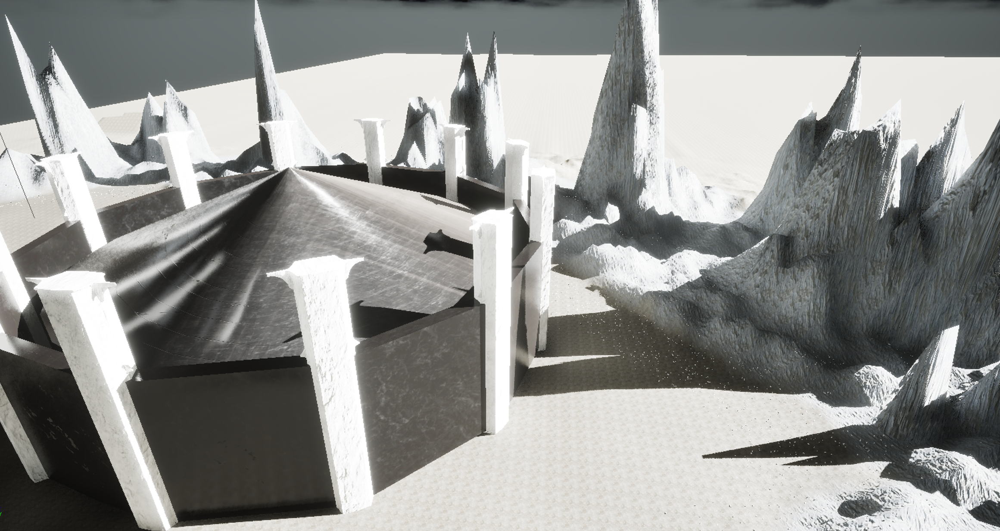
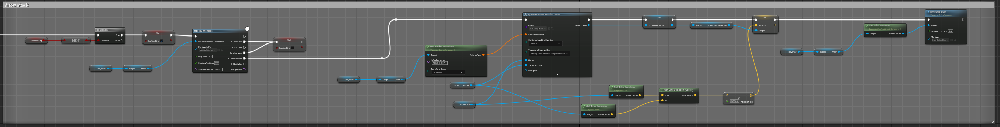
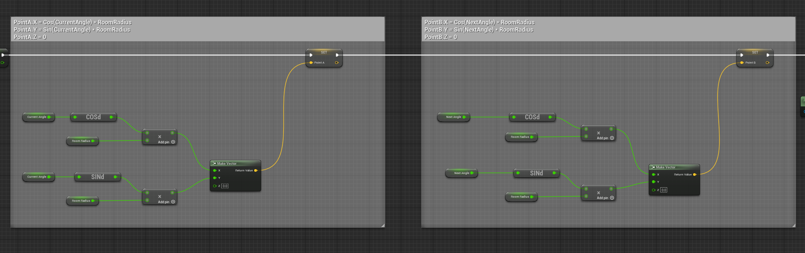
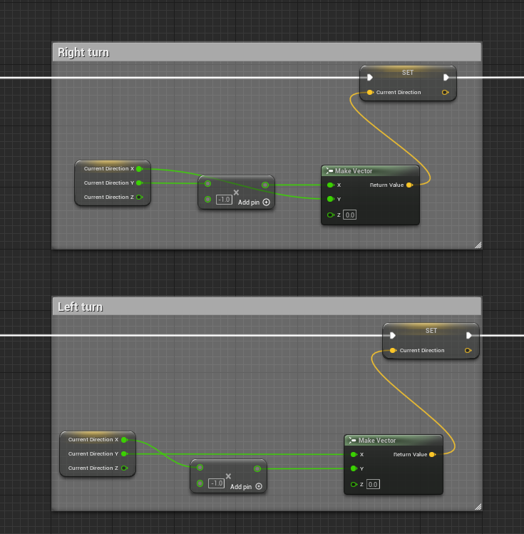
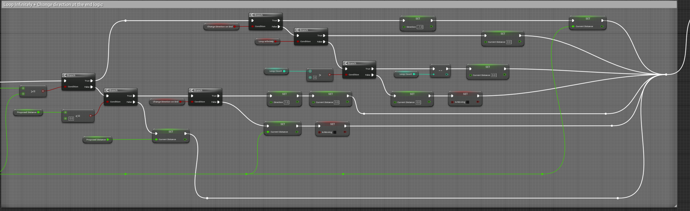
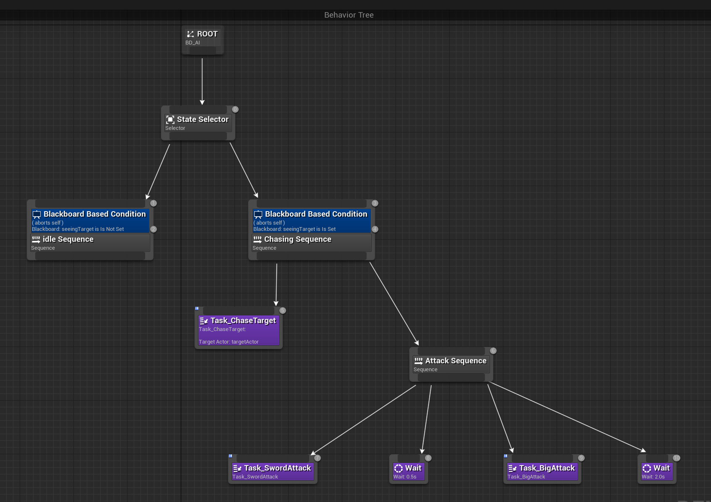
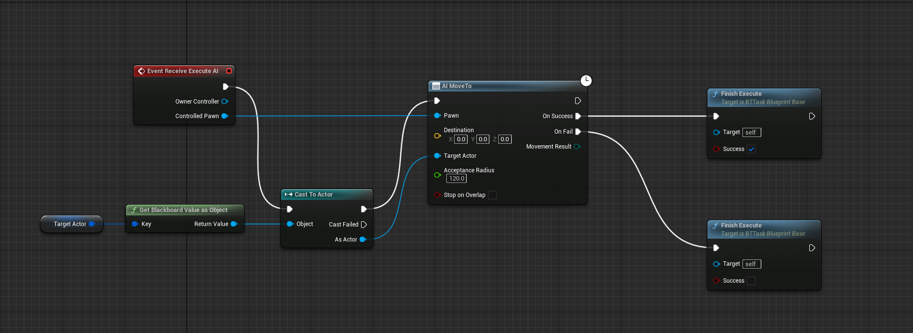
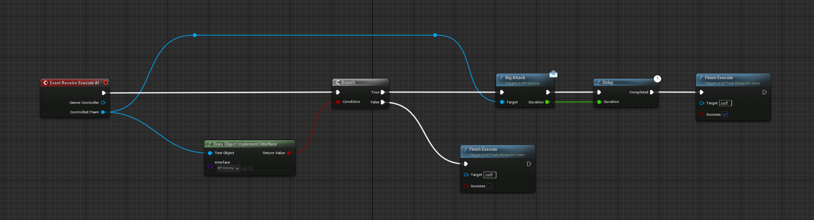
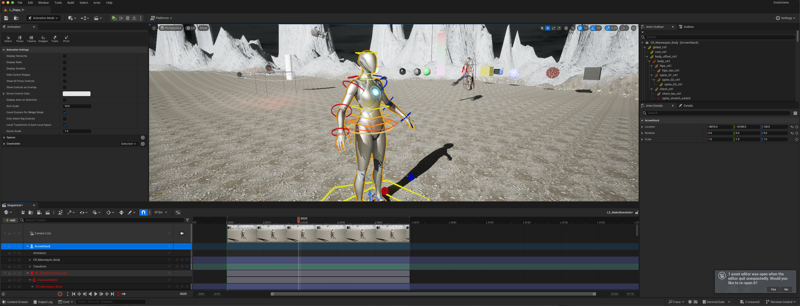
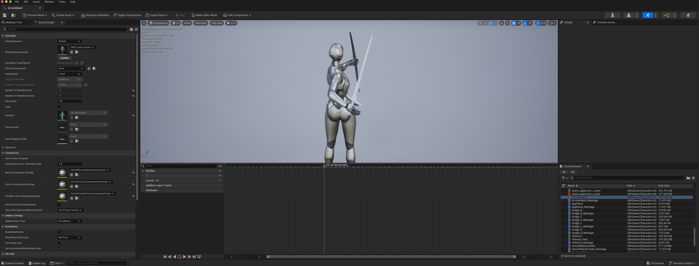

# **Broken Guardians**: Proiect pentru Dezvoltarea Jocurilor 3D in Unreal Engine 5

## Cuprins

1. [Descrierea Detaliata a Jocului](#1-descrierea-detaliata-a-jocului)
2. [Specificatii Tehnice](#2-specificatii-tehnice)
3. [Specificatii Tematice](#3-specificatii-tematice)
4. [Actiuni Disponibile si Control](#4-actiuni-disponibile-si-control)
5. [Clasele Proprii](#5-clasele-proprii)
6. [Algoritmi](#6-algoritmi)
7. [Unelte de Inteligenta Artificiala din Unreal](#7-unelte-de-inteligenta-artificiala-din-unreal)
8. [Lista de Taskuri Realizate](#8-lista-de-taskuri-realizate)
9. [Lista de Utilitare Folosite](#9-lista-de-utilitare-folosite)
10. [Lista de Pachete Externe Folosite](#10-lista-de-pachete-externe-folosite)
11. [Bibliografie](#11-bibliografie)

---

## 1. Descrierea Detaliata a Jocului

### Concept si Poveste

**Broken Guardians** ("Gardienii Franti") este un joc de tip Action-RPG in genul Souls-like Boss Rush, dezvoltat in Unreal Engine 5. Jocul prezinta o poveste dark fantasy despre coruptie, sacrificiu si rascumparare.

**Povestea:** Gardienii Franti — fosti frati de arme, acum umbre ale datoriei. Ei pazesc o relicva: o poarta deschisa ce aduce demoni in lumea noastra. Puterea ei i-a corupt, transformandu-i in monstri loiali. Tu ai fost unul dintre ei. Ai refuzat blestemul si ai fugit. Dar ai luat coruptia cu tine. Demonul tau interior castiga controlul. Acum te intorci sa distrugi sursa. O ultima datorie, de data asta reala. Ei iti stau in cale — pentru a te opri, sunt gata sa isi sacrifice si ultima farama de vointa, oferindu-se complet puterii care ii devoreaza.

### Ce s-a Implementat

Jocul se afla intr-o stare functionala de prototip, cu accent pe sistemele fundamentale de lupta si pe un framework scalabil pentru crearea de boss fights.

**Sistemul de Lupta:**
- **Doua arme functionale:** sabie si arc, cu atacuri distincte si animatii dedicate
- **Target Locking:** sistem de blocare pe tinte (orice Pawn din scena) cu rotirea camerei si ajustarea directiei proiectilelor / animatiilor
- **Rolling/Dodge:** sistem de ferire pentru evitarea atacurilor inamice
- **Sistem de Damage si Health Bars:** bara de viata vizibila pentru jucator si inamici

**Inamici in Scena:**
- Un inamic de baza (pentru testare si demonstratie)
- Un boss principal cu atacuri variate (implementate prin behavior trees)

**Algoritmi si Sisteme Complexe:**
- Sistem avansat de functionare a arcului cu fizica realista a proiectilelor
- Sistem de coliziuni optimizat pentru combat
- **Generare procedurala** pentru capela din arena: numar variabil de stalpi si pereti, dimensiuni configurabile
- **Implementare complexa de Spline:** zone de viteza, viraje aleatorii, utilizat pentru traiectorii de atac si testing

**Scenografie Tematica:**
- Arena de lupta stilizata ca un munte corupt
- Skybox potrivit atmosferei dark fantasy
- Capela generata procedural, integrata in ambient




---

## 2. Specificatii Tehnice

- **Sistem de operare:** macOS (dezvoltat pe MacBook Pro M4 Pro), compatibil Windows 10/11
- **Spatiu pe disc:** ~50 GB (proiect complet cu assets)
- **Memorie RAM necesara:** minimum 16 GB, recomandat 24 GB (dezvoltarea a fost realizata pe 24gb de ram)
- **IDE/Build Tools:** Xcode (pentru macOS)
- **Pachete aditionale:** Niciuna
- **Conexiune la retea:** Nu este necesara (joc single-player offline)
- **Date salvate:** Jocul nu implementeaza inca un sistem de save; datele de configurare sunt stocate in folderul `Saved/Config/`
- **Versiune Unreal Engine:** 5.4.4

---

## 3. Specificatii Tematice

- **Categorii:** Action-RPG, Adventure, Souls-like, Boss Rush
- **Motivatia temei:** Pasiunea pentru jocurile FromSoftware si dorinta de a recrea experienta intensa si cinematica a luptelor din acestea
- **Taguri:** Souls-like, Boss Rush, Dark Fantasy, Action-RPG, Challenging, Skill-Based, Horror, Single Player
- **Mod de joc:** Single Player
- **Timp estimat de joc:** 1-3 ore pentru completare (variabil in functie de skill)
- **Limbi disponibile:** Engleza

---

## 4. Actiuni Disponibile si Control

Jocul utilizeaza sistemul **Enhanced Input** din Unreal Engine 5 pentru gestionarea inputurilor. Controalele sunt gandite pentru tastatura si mouse.

### Schema de Control

| Actiune | Tasta/Buton | Descriere |
|---------|-------------|-----------|
| **Miscare** | W, A, S, D | Deplasarea caracterului in cele 4 directii |
| **Rotire Camera** | Mouse | Controlul camerei pentru orientare |
| **Atac** | Left Click | Atac cu arma curenta; pentru sabie, click-uri succesive activeaza combo-uri |
| **Roll/Dodge** | Shift | Rostogolire pentru evitarea atacurilor inamice |
| **Target Lock** | Q | Blocheaza camera pe cel mai apropiat inamic |
| **Schimbare Arma** | Tab | Alternare intre sabie si arc |

### Input Actions (Enhanced Input System)

Sistemul de input este implementat prin urmatoarele actiuni definite in Unreal:

- `IA_Move` - Miscare pe axele X si Y
- `IA_Look` - Rotirea camerei
- `IA_Attack` - Declansare atac
- `IA_Dodge` - Actiune de rostogolire
- `IA_Lock` - Activare/dezactivare target lock
- `IA_SwitchWeapon` - Schimbarea armei active
- `IA_GenerateSplinePath` - Actiune de debug pentru generarea traiectoriilor spline

### Note

- Nu exista optiuni de remapare a tastelor in versiunea curenta
- Actiunea `IA_GenerateSplinePath` este utilizata doar pentru debugging si testare

---

## 5. Clasele Proprii

### 5.1 Componenta de Combat (BPC_Combat)

**Componenta de Combat** este nucleul sistemului de lupta, gestionand blocarea pe tinte, atacurile si interactiunea cu inamicii. Aceasta mentine starea curenta a luptei: tinta blocata, arma echipata, daca jucatorul este in mijlocul unui atac sau unei feriri. Componenta foloseste sistemul de input pentru a raspunde la comanda de blocare pe tinta, implementand un sistem toggle: daca exista deja o tinta blocata, aceasta este eliberata si miscarea caracterului revine la normal; daca nu exista tinta, se efectueaza o detectie automata a inamicilor.

**Detectia tintelor** se realizeaza prin **Sphere Trace** — un algoritm de collision detection care proiecteaza o sfera invizibila in directia camerei. Trace-ul porneste de la pozitia camerei jucatorului si se extinde inainte, cautand inamici. Cand o tinta valida este detectata, aceasta este stocata, iar la fiecare frame componenta calculeaza rotatia necesara pentru a mentine camera orientata catre inamic. Aceasta abordare ofera un balans optim intre performanta si acuratete pentru sistemul de target lock.

**Sistemul de atac cu arcul** integreaza **Animation Montages** pentru a sincroniza spawn-ul proiectilelor cu animatia. Cand se initiaza un atac, se porneste animatia corespunzatoare, iar la un moment specific din aceasta (definit printr-un **Animation Notify**), se obtine pozitia armei si se spawn-eaza proiectilul. Daca exista o tinta blocata, aceasta este transmisa proiectilului pentru a activa comportamentul de urmarire automata (homing).

### 5.2 Generator Procedural de Capela (BP_ChapelGenerator)

**Generatorul de Capela** este un sistem de **procedural generation** care construieste structuri circulare modulare din componente individuale: stalpi, pereti si cupola. Generatorul este parametrizabil prin variabile expuse in editor: numarul de pereti si usi, raza incintei, si inaltimile fiecarei componente. Sistemul este proiectat pentru a permite regenerarea rapida in editor, curatand intai constructia existenta inainte de a genera una noua.

**Algoritmul de constructie** foloseste un loop care itereaza prin numarul specificat de pereti. Pentru fiecare iteratie, se calculeaza pozitia curenta si urmatoarea pe un cerc folosind **functii trigonometrice** (cosinus si sinus) aplicate la unghiul curent inmultit cu raza. Astfel, fiecare stalp este pozitionat pe circumferinta cercului, orientat catre centru pentru a obtine efectul de cupola convergenta. Intre doi stalpi consecutivi se spawn-eaza un perete, scalat si rotit corespunzator pentru a acoperi distanta dintre punctele calculate.

**Sistemul de management al actorilor** mentine o lista a tuturor actorilor generati, permitand curatarea completa inainte de o regenerare. La finalizarea loop-ului principal, se spawn-eaza cupola centrala cu dimensiunile calculate din parametrii structurii. Aceasta abordare modulara permite ajustarea rapida a aspectului capelei direct din editor, fara a necesita modificari in logica blueprint-ului.

### 5.3 Componenta de Statistici (BPC_Stats)

**Componenta de Statistici** gestioneaza atributele numerice ale unui actor, precum viata curenta si viata maxima. Aceasta poate fi atasata atat jucatorului cat si inamicilor, oferind un sistem unificat de management al starii de sanatate. Componenta include o referinta optionala catre un widget de tip bara de progres pentru afisarea vizuala a starii de viata in interfata utilizatorului.

**Functia de modificare a valorilor** primeste ca parametri tipul statisticii (printr-o enumeratie) si valoarea de modificat. Folosind o structura de tip switch, sistemul directioneaza modificarea catre statistica corecta. Pentru sanatate, valoarea noua este calculata adunand modificarea la valoarea curenta, apoi rezultatul este **clamped** (limitat) intre zero si valoarea maxima pentru a preveni depasirea limitelor. Dupa actualizarea valorii, daca bara de progres este valida, aceasta este actualizata automat cu procentul curent.

**Sistemul de moarte** este declansat automat cand valoarea vietii scade la sau sub zero. In loc sa implementeze direct logica de moarte, componenta apeleaza o **interfata** pe actorul parinte, permitand fiecarui tip de actor sa defineasca propriul comportament de moarte. Aceasta abordare bazata pe interfete ofera flexibilitate si decuplare intre logica de statistici si comportamentul specific fiecarui actor.

### 5.4 Personajul Principal (BP_ThirdPersonCharacter)

**Personajul Principal** este blueprint-ul central al jucatorului, integrand toate componentele necesare pentru gameplay. Acesta mosteneste clasa **Character** din Unreal Engine, beneficiind astfel de functionalitati built-in precum miscarea, saltul si coliziunea. Blueprint-ul foloseste o arhitectura modulara prin compozitie: **BPC_Combat** pentru sistemul de lupta, **BPC_Stats** pentru gestionarea vietii, si componente mesh separate pentru fiecare arma (sabie, arc).

**Sistemul de input** este construit pe **Enhanced Input System**, configurand la **BeginPlay** contextul de mapare prin subsistemul local al player-ului. Pentru miscare, actiunea **IA_Move** primeste un vector 2D care este descompus in componente X (stanga/dreapta) si Y (inainte/inapoi). Directia miscarii este calculata relativ la camera: se obtine rotatia controller-ului, din care se extrage componenta Yaw, si se genereaza vectorii **Forward** si **Right** corespunzatori. Miscarea se aplica prin **AddMovementInput** cu acesti vectori scalati de valorile inputului. Camera este controlata separat prin actiunea **IA_Look**, care modifica direct rotatia controller-ului folosind **AddControllerYawInput** si **AddControllerPitchInput**.

**Implementarea interfetei BPI_Damage** asigura comunicarea cu sistemul de animatie. Evenimentele **Begin Sword Trace** si **End Sword Trace**, declansate de Animation Notifies din montaj-uri, sunt delegate catre componenta **BPC_Combat** care gestioneaza detectia coliziunilor armei. Aceasta separare permite animatorilor sa controleze precis momentele active ale atacului fara a modifica logica de combat.

**Raspunsul la damage** este procesat prin evenimentul **ReceiveAnyDamage**. Valoarea primita este negata si transmisa catre **BPC_Stats** pentru a reduce viata. Simultan, se porneste un **Animation Montage** de reactie la lovitura, iar viteza de miscare este temporar redusa pentru a crea efectul de stagger. Dupa completarea montaj-ului, viteza revine la normal. **Sistemul de moarte**, implementat prin interfata **Die**, dezactiveaza componenta de miscare si activeaza simularea fizicii pe mesh-ul personajului, creand efectul de ragdoll.

### 5.5 Inamicul de Baza (BP_Enemy)

**Inamicul de Baza** este blueprint-ul parinte pentru toate tipurile de inamici din joc, inclusiv bossul. Acesta mosteneste clasa **Character** si implementeaza interfata **BPI_Damage** pentru a permite comunicarea cu sistemul de animatie si damage. Blueprint-ul contine componenta **BPC_Stats** pentru gestionarea vietii, un **WidgetComponent** pentru afisarea barei de viata deasupra capului, si componente auxiliare pentru pozitionarea trace-urilor de atac.

**Sistemul de damage trace** foloseste un **Timer cu delegate** pentru a executa detectia coliziunilor in mod repetat pe durata unui atac. La evenimentul **Begin Sword Trace**, se porneste un timer care apeleaza functia **Damage Trace** la intervale foarte mici. Aceasta functie verifica mai intai daca inamicul este in viata, apoi executa un **SphereTraceMultiForObjects** intre pozitiile componentelor de start si end ale sabiei. Trace-ul returneaza o lista de hit results care este parcursa cu **ForEachLoopWithBreak**. Pentru fiecare actor lovit, se aplica damage folosind **ApplyDamage** cu valoarea din variabila **swordDamage**. Un macro **DoOnce** previne aplicarea multipla a damage-ului pe acelasi actor in cadrul aceluiasi swing.

**Raspunsul la damage** este similar cu cel al jucatorului: evenimentul **ReceiveAnyDamage** primeste valoarea, o inmulteste cu -1 pentru a o transforma in scadere, si o transmite catre **BPC_Stats.IncreaseValue**. La **BeginPlay**, blueprint-ul obtine referinta la widget-ul de viata si configureaza bara de progres in componenta de statistici.

**Sistemul de moarte** implementeaza evenimentul **Die** din interfata: dezactiveaza componenta de miscare, activeaza simularea fizicii pentru ragdoll.

### 5.6 Clase Auxiliare si Complementare

Proiectul include o serie de clase auxiliare care extind si complementeaza sistemele principale descrise anterior:

**Proiectile si Efecte**: **BP_HomingArrow** este proiectilul principal pentru arcul jucatorului, implementand comportament de urmarire automata (homing) catre tinta blocata folosind component-ul **ProjectileMovement** cu optiunea homing activata. **BP_GlowingProjectile** adauga efecte vizuale emissive si lumina dinamica proiectilelor. **BP_SplinePathActor** defineste traiectorii predefinite pentru proiectile sau alte obiecte care urmaresc spline-uri.

**Sistemul AI**: **BP_Enemy_Boss** extinde **BP_Enemy** cu atacuri suplimentare (atac mare, atac cu explozie) si animatii specifice bossului Grux. **BP_AI_Enemy** si **BP_AI_Enemy_Boss** sunt controller-ele AI care ruleaza **Behavior Tree**-urile respective (**BT_Enemy**, **BT_Boss**). Task-urile (**Task_SwordAttack**, **Task_BigAttack**, **Task_ChaseTarget**) implementeaza actiunile specifice din arborele de comportament. **BD_AI** este Blackboard-ul partajat care stocheaza datele de decizie AI precum referinta la jucator si distanta curenta.

**Interfata Utilizator**: **WB_Hud** este widget-ul principal HUD care contine **WB_PlayerHealth** pentru bara de viata a jucatorului. **WB_EnemyHealth** este afisat pe inamici prin WidgetComponent in spatiul lumii. **WB_TargetLock** si **BP_TargetLockWidget** afiseaza indicatorul de blocare pe tinta.

**Animation Notifies**: **BP_Notify_Damage** si **BP_Notify_PointDamage** sunt notificari personalizate care se plaseaza in Animation Montages pentru a declansa evenimentele **Begin Sword Trace** si **Point Damage Trace** din interfata BPI_Damage la momente precise din animatie.

**Generare Procedurala**: Componentele capelei (**BP_Part_Dome**, **BP_Part_Door**, **BP_Part_Pillar**, **BP_Part_Wall**) sunt actori simpli cu mesh-uri statice, spawn-ati si pozitionati de **BP_ChapelGenerator**.

**Tipuri de Date**: Enumeratiile **E_Stats** si **E_MovementDirection** definesc tipuri pentru sistemul de statistici si directii de miscare. Structura **S_SpeedZone** stocheaza parametrii zonelor de viteza pentru **BPC_SplineFollower**. Interfata **BPI_Damage** declara evenimentele comune pentru damage trace si moarte, implementate de jucator si inamici.

---

## 6. Algoritmi

### 6.1 Algoritm Arc/Proiectile

Sistemul de proiectile foloseste componenta **ProjectileMovementComponent** din Unreal Engine pentru a crea sageti cu comportament de urmarire (homing). Arhitectura implica doua Blueprint-uri: **BPC_Combat** (lansare) si **BP_HomingArrow** (comportament).



#### 6.1.1 Lansarea Proiectilului

Cand jucatorul executa atacul cu arcul, **BPC_Combat** spawn-eaza actorul `BP_HomingArrow` la pozitia socket-ului `hand_l_bow` de pe Skeletal Mesh. La spawn, se transmit doi parametri esentiali:
- **Owner** = jucatorul (pentru filtrarea coliziunilor)
- **targetToChase** = actorul tinta blocat (Target Lock Actor)

#### 6.1.2 Comportamentul de Urmarire (Homing)

In **BeginPlay** al sagetii, daca `targetToChase` este valid, se configureaza componenta de homing:

```
ProjectileMovement.HomingTargetComponent = targetToChase.RootComponent
```

Componenta **ProjectileMovementComponent** are proprietati predefinite pentru homing:
- **bIsHomingProjectile** = true (activeaza urmarirea)
- **HomingAccelerationMagnitude** = acceleratia catre tinta
- **HomingTargetComponent** = componenta scene a tintei

Unreal Engine gestioneaza intern ajustarea traiectoriei la fiecare frame.

#### 6.1.3 Filtrarea Coliziunilor

La evenimentul **OnActorBeginOverlap**, sageata verifica daca actorul cu care s-a suprapus este diferit de Owner:

```
Daca OtherActor != GetOwner():
    DestroyActor()
```

Aceasta previne auto-distrugerea sagetii la coliziunea cu jucatorul care a lansat-o.

**Complexitate timp**: O(1) per frame pentru calculul homing (efectuat de engine).
**Complexitate spatiu**: O(1) - un singur actor activ per proiectil.

### 6.2 Generare Procedurala - Capela

Blueprint-ul **BP_ChapelGenerator** construieste o capela circulara folosind coordonate polare convertite in coordonate carteziene. Algoritmul distribuie stalpi si pereti uniform pe circumferinta unui cerc.

#### 6.2.1 Distributia Unghiulara

Pentru a plasa **n** elemente egal distantate pe un cerc, unghiul dintre elemente consecutive este:

```
anglePerStep = 360° / numberOfWalls
```

La fiecare iteratie **i** a buclei ForLoop (de la 0 la numberOfWalls-1):

```
currentAngle = anglePerStep * i
nextAngle = anglePerStep * (i + 1)
```

Aceste unghiuri definesc pozitiile a doua puncte consecutive pe cerc: **PointA** (stalpul curent) si **PointB** (stalpul urmator).

#### 6.2.2 Conversia Polar-Cartezian

Pozitia fiecarui punct pe cerc se calculeaza folosind formulele standard de conversie din coordonate polare (unghi, raza) in coordonate carteziene (X, Y):

```
PointA.X = Cos(currentAngle) * roomRadius
PointA.Y = Sin(currentAngle) * roomRadius
PointA.Z = 0

PointB.X = Cos(nextAngle) * roomRadius
PointB.Y = Sin(nextAngle) * roomRadius
PointB.Z = 0
```



Blueprint-ul foloseste nodurile **DegCos** si **DegSin** care accepta unghiuri in grade (nu radiani), simplificand calculele.

#### 6.2.3 Plasarea Componentelor

**Stalpi**: Se spawn-eaza la pozitia `ActorLocation + PointA`. Rotatia se calculeaza cu **FindLookAtRotation** de la PointA catre centru (origine), astfel incat stalpii sa fie orientati radial.

**Pereti**: Se plaseaza la punctul de mijloc dintre PointA si PointB:
```
wallPosition = (PointA + PointB) / 2 + ActorLocation
```
Rotatia peretilor se calculeaza cu **FindLookAtRotation** de la wallPosition catre centru.

**Cupola**: Se spawn-eaza o singura data la centrul capelei, dupa ce bucla principala se termina.

#### 6.2.4 Scalarea Dinamica

Inaltimea stalpilor si peretilor se controleaza prin scalare pe axa Z:
```
pillarScale.Z = pillarHeight / pillarMeshHeight
wallScale.Z = wallHeight / wallMeshHeight
```

Aceasta permite ajustarea dimensiunilor fara a modifica mesh-urile originale.

**Complexitate timp**: O(n) unde n = numberOfWalls.
**Complexitate spatiu**: O(n) pentru stocarea actorilor generati in array-ul `generatedActors`.

### 6.3 Implementare Spline cu Zone de Viteza

Sistemul de spline combina doua componente: **BP_SplinePathActor** pentru generarea traseului si **BPC_SplineFollower** pentru deplasarea pe traseu cu viteza variabila.

#### 6.3.1 Generare Aleatorie a Traseului

Functia **GenerateRandomPath** construieste un spline procedural folosind viraj-uri de 90 de grade. Algoritmul mentine doua variabile locale: **CurrentLocation** (pozitia curenta) si **CurrentDirection** (vectorul directiei curente, initial `(1, 0, 0)`).

**Problema matematica**: Pentru a efectua un viraj de 90 grade in plan 2D, trebuie aplicata o matrice de rotatie. In loc sa folosim functii trigonometrice costisitoare, ne folosim de faptul ca rotatia cu 90 grade are o forma simplificata:

```
Rotatie dreapta (+90°):  X_nou = -Y_vechi,  Y_nou = X_vechi
Rotatie stanga  (-90°):  X_nou = Y_vechi,   Y_nou = -X_vechi
```



Blueprint-ul implementeaza aceste formule prin **Break Vector** pentru a extrage componentele X si Y, inmultire cu -1 pentru negare, si **Make Vector** pentru a reconstrui vectorul rotit. Decizia stanga/dreapta este luata folosind **RandomBool** la fiecare iteratie.

Dupa rotatie, noua pozitie se calculeaza: `CurrentLocation = CurrentLocation + CurrentDirection * RandomFloatInRange(MinLength, MaxLength)`. Punctul rezultat este adaugat la spline cu tip **Linear** pentru segmente drepte.

**Complexitate timp**: O(n) unde n = NumSegments. Fiecare segment necesita operatii constante (random, inmultiri vectoriale, adaugare punct).
**Complexitate spatiu**: O(n) pentru stocarea punctelor spline-ului.

#### 6.3.2 Miscarea Bidirectionala pe Spline

Componenta **BPC_SplineFollower** urmareste pozitia pe spline folosind variabila **currentDistance** care reprezinta distanta parcursa de-a lungul curbei. La fiecare **Tick**:

1. Se calculeaza viteza curenta din **baseSpeed** si zona de viteza activa
2. Se actualizeaza distanta: `currentDistance += movementSpeed * direction * DeltaTime`
3. Variabila **direction** este +1 pentru deplasare inainte si -1 pentru inapoi
4. Se obtine pozitia pe spline cu **GetLocationAtDistanceAlongSpline(currentDistance)**
5. Actorul parinte este mutat la aceasta pozitie

**Inversarea directiei** se produce cand `currentDistance` depaseste lungimea totala a spline-ului sau scade sub zero. Daca **changeDirectionOnEnd** este activ, se inverseaza valoarea lui **direction**. Alternativ, **loopInfinitely** reseteaza distanta la capatul opus pentru miscare continua.



**Complexitate timp per frame**: O(1) pentru actualizarea distantei, O(log n) pentru interpolare pe spline (intern in Unreal).

#### 6.3.3 Zonele de Viteza

Array-ul **speedZones** contine structuri **S_SpeedZone**, fiecare definind un interval de distanta si un multiplicator de viteza. Functia **Calculate Current Speed** parcurge array-ul si verifica daca **currentDistance** se afla in intervalul fiecarei zone:

```
Pentru fiecare zona in speedZones:
    Daca currentDistance >= zona.StartDistance SI currentDistance <= zona.EndDistance:
        Return baseSpeed * zona.SpeedMultiplier
Return baseSpeed  // viteza implicita daca nu e in nicio zona
```

Aceasta abordare permite definirea de zone de accelerare, incetinire sau oprire de-a lungul traseului, utila pentru efecte gameplay precum rampe sau obstacole.

**Complexitate timp**: O(k) unde k = numarul de zone de viteza.
**Complexitate spatiu**: O(k) pentru stocarea zonelor.

---

## 7. Unelte de Inteligenta Artificiala din Unreal

Sistemul AI al inamicilor foloseste **Behavior Trees** pentru logica decizionala si **Blackboard** pentru stocarea datelor partajate intre noduri.

### 7.1 Structura Behavior Tree

Arborele de comportament **BT_Boss** este organizat ierarhic:



- **ROOT** → **State Selector** (nod Selector)
  - **Idle Sequence** - activat cand `seeingTarget` NU este setat
  - **Chasing Sequence** - activat cand `seeingTarget` ESTE setat
    - **Task_ChaseTarget** - urmareste jucatorul
    - **Attack Sequence** - executa atacuri in ordine:
      - Task_SwordAttack → Wait(0.5s) → Task_BigAttack → Wait(2.0s)

Nodurile **Blackboard Based Condition** actioneaza ca decoratori, permitand sau blocand executia ramurilor in functie de starea variabilelor din Blackboard.

### 7.2 Blackboard

Blackboard-ul (memoria inamicului) contine urmatoarele:

| Cheie | Tip | Descriere |
|-------|-----|-----------|
| SelfActor | Actor | Referinta la inamicul controlat |
| seeingTarget | Boolean | Indica daca inamicul vede jucatorul |
| targetActor | Actor | Referinta la jucatorul detectat |

### 7.3 Task-uri Custom

Toate task-urile extind clasa **BTTask_BlueprintBase** si folosesc evenimentul **ReceiveExecuteAI** care furnizeaza `OwnerController` si `ControlledPawn`.

#### 7.3.1 Task_ChaseTarget

Acest task muta inamicul catre jucator:

1. Citeste `targetActor` din Blackboard folosind **GetBlackboardValueAsObject**
2. Cast la Actor
3. Apeleaza **AI MoveTo** cu:
   - Pawn = ControlledPawn
   - TargetActor = targetActor din Blackboard
   - AcceptanceRadius = 120 unitati
4. La **OnSuccess** → `FinishExecute(true)`
5. La **OnFail** → `FinishExecute(false)`



#### 7.3.2 Task_SwordAttack si Task_BigAttack

Aceste task-uri partajeaza acelasi pattern de executie:

1. Verifica daca ControlledPawn implementeaza interfata **BPI_Enemy** folosind `DoesImplementInterface`
2. Daca DA:
   - Apeleaza metoda de interfata (`SwordAttack` sau `BigAttack`) pe ControlledPawn
   - Primeste `Duration` ca output din apelul de interfata
   - Foloseste **Delay** cu durata returnata pentru a astepta finalizarea animatiei
   - `FinishExecute(true)`
3. Daca NU:
   - `FinishExecute(false)` - task-ul esueaza



### 7.4 Interfata BPI_Enemy

Interfata **BPI_Enemy** defineste contractul pentru comportamentele de atac ale inamicilor:

- **SwordAttack()** → returneaza `Duration` (durata animatiei)
- **BigAttack()** → returneaza `Duration` (durata animatiei)

Aceasta arhitectura permite task-urilor din Behavior Tree sa ramana generice, delegand implementarea specifica fiecarui tip de inamic.

---

## 8. Lista de Taskuri Realizate

<PLACEHOLDER>

---

## 9. Lista de Utilitare Folosite

### 9.1 Surse de Active

Toate activele vizuale (modele 3D, texturi, materiale) provin din doua surse principale:

| Sursa | Tip Active | Exemple |
|-------|-----------|---------|
| **Fab.com** | Modele 3D, animatii, materiale | Personaje, arme |
| **Quixel Megascans** | Texturi PBR, materiale | Texturi pentru teren, piatra |

### 9.2 Animatie Custom - Tragere cu Arcul

Singura animatie creata manual este animatia de tragere cu arcul (**ArrowAttack**). Aceasta a fost realizata folosind **Level Sequencer** din Unreal Engine.



Procesul a constat in:
1. Importarea scheletului personajului in Sequencer
2. Setarea keyframe-urilor pentru pozitia bratelor si mainilor
3. Exportarea animatiei ca **Animation Sequence** pentru utilizare in Animation Blueprint



Aceasta metoda permite crearea rapida de animatii simple direct in engine, fara a necesita software extern de animatie 3D.

---

## 10. Lista de Pachete Externe Folosite

| Pachet | Sursa | Utilizare in Joc |
|--------|-------|------------------|
| **Good Sky** | [Epic Games Marketplace](https://www.unrealengine.com/marketplace/en-US/product/good-sky) | Skybox pentru atmosfera dark fantasy corupta |
| **Paragon: Kwang** | [Epic Games / Paragon Assets](https://www.unrealengine.com/marketplace/en-US/product/paragon-kwang) | Modelul pentru caracterul jucatorului |
| **Paragon: Grux** | [Epic Games / Paragon Assets](https://www.unrealengine.com/marketplace/en-US/product/paragon-grux) | Modelul si o parte din animatiile pentru boss-ul principal |
| **Paragon: Agora and Monolith Environment** | [Epic Games / Paragon Assets](https://www.unrealengine.com/marketplace/en-US/product/paragon-agora-and-monolith-environment) | Stalpii si o parte din materialele utilizate in scena arenei |

---

## 11. Bibliografie

### Tutoriale Video
- [How to Create a Souls-Like Game in Unreal Engine 5](https://www.youtube.com/watch?v=Hs2sM7eFf6Q) → sistemul de target lock si combat (tutorial introductiv foarte bun pentru jocuri Souls-Like)
- [Animations in Unreal](https://www.youtube.com/watch?v=tnZv7KQPai0) → tehnica de keyframe pentru bow animation
- [Gradient materials in unreal](https://www.youtube.com/watch?v=P_HL_rIWulo&t=347s) → materialele de dublu si triplu gradient din etapa 1

### Documentatie si Sintaxa Blueprints
- [Unreal Engine Documentation](https://dev.epicgames.com/documentation/en-us/unreal-engine/unreal-engine-5-4-documentation?application_version=5.4) → documentatia oficiala
- **AI Models** → Gemini 2.5 Pro, Claude 4 Sonnet → modele foarte bune pentru explicatii in blueprints, sintaxa si design patterns in Unreal

### Surse de Active
- [Fab](https://www.fab.com/)
- [Quixel Megascans](https://quixel.com/megascans)

---
